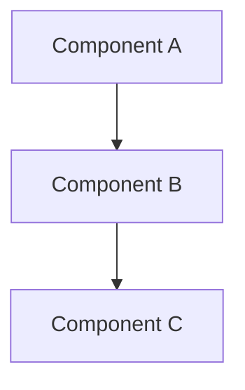

# CLAUDE.design.md

Phase-specific instructions for the **Design** phase. Extends [../CLAUDE.md](../CLAUDE.md).

## Purpose

This phase defines **how** we're building the system. Focus on architecture, data models, APIs, and key technical decisions.

## Files in This Phase

| File | Purpose |
|------|---------|
| `architecture.md` | System architecture overview and diagrams |
| `data-model.md` | Data structures, schemas, and relationships |
| `api-design.md` | API specifications and contracts |
| `decisions/` | Architecture Decision Records (ADRs) |

## AI Guidelines for This Phase

### When Designing Architecture
- Consider scalability, maintainability, and simplicity
- Document component responsibilities and interactions
- Use diagrams where helpful (Mermaid syntax is preferred)
- Reference requirements from `01-objectives/`

### When Modeling Data
- Define clear schemas with types and constraints
- Document relationships between entities
- Consider data lifecycle (creation, updates, deletion)
- Plan for data validation and integrity

### When Designing APIs
- Follow REST conventions or document deviations
- Define request/response formats clearly
- Document error handling and status codes
- Consider versioning strategy
- **API response types must be explicit**: Every endpoint should have a named response type derived from internal entity types. Never return raw internal entities — use mapper functions to strip internal fields and add computed fields.
- **List endpoints use named fields**: Return `{ users: [...] }`, `{ products: [...] }`, etc. — not generic `{ items: [...] }`.
- **Response envelope**: Standardize on a consistent wrapper (e.g., `{ success: true, data: {...} }`). The design spec documents the `data` payload only.

### When Recording Decisions (ADRs)
- Document the context and problem
- List options considered with pros/cons
- Record the decision and rationale
- Note consequences and trade-offs

## ADR Template

Use this template for Architecture Decision Records in `decisions/`:

```markdown
# ADR-[NUMBER]: [Title]

**Date**: YYYY-MM-DD
**Status**: Proposed / Accepted / Deprecated / Superseded

## Context

What is the issue or question we need to address?

## Options Considered

### Option A: [Name]
- Pros: ...
- Cons: ...

### Option B: [Name]
- Pros: ...
- Cons: ...

## Decision

What did we decide and why?

## Consequences

What are the implications of this decision?
```

## Diagram Guidelines

Use Mermaid for diagrams:



## Linking to Other Phases

- Reference requirements from `01-objectives/` to justify design choices
- Design documents guide implementation in `03-code/`
- Infrastructure design informs deployment in `04-deploy/`
