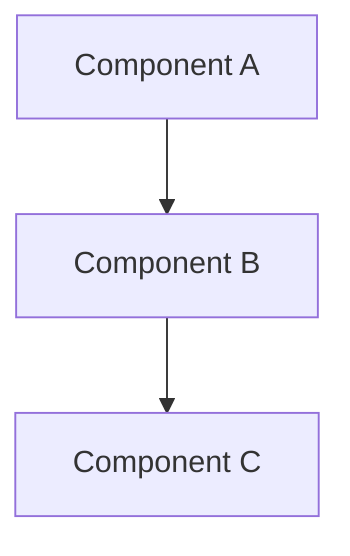

# CLAUDE.design.md

Phase-specific instructions for the **Design** phase. Extends [../CLAUDE.md](../CLAUDE.md).

## Purpose

This phase defines **how** we're building the system. Focus on architecture, data models, APIs, and key technical decisions.

## Files in This Phase

| File | Purpose |
|------|---------|
| [`architecture.md`](architecture.md) | System architecture overview and diagrams |
| [`data-model.md`](data-model.md) | Data structures, schemas, and relationships |
| [`api-design.md`](api-design.md) | API specifications and contracts |
| [`decisions/`](decisions/) | Decision Records (DEC-NNN) |

---

## Decisions Relevant to This Phase

<!-- Add rows as decisions are recorded. -->

| ID | Title | Trigger |
|----|-------|---------|
| [DEC-001](decisions/DEC-001-error-format.md) | Error Response Format | When specifying error responses for any API or interface |

---

## AI Guidelines

### Architecture
- Default to the simplest design that satisfies all requirements; add complexity only when justified
- Document component responsibilities and interactions
- Use Mermaid diagrams where helpful
- Reference requirements from `1-objectives/`

### Data Modeling
- Define clear schemas with types and constraints
- Document relationships between entities
- Consider data lifecycle (creation, updates, deletion)

### API Design
- Follow REST conventions or document deviations
- Define request/response formats clearly
- Document error handling and status codes
- Consider versioning strategy

### Diagrams

Use Mermaid syntax:

---

## Deprecating or Superseding a Decision

A decision should be deprecated when no longer relevant, or superseded when a new decision replaces it.

**Never deprecate or supersede silently.** Always surface the proposal to the user first.

1. **Identify the candidate**: note the DEC-NNN ID and reason for retirement.
2. **Read both files**: `DEC-NNN.md` and `DEC-NNN.history.md` to understand full context.
3. **Ask the user.** Present:
   - Why the decision is no longer valid or should be replaced
   - Whether existing code, infrastructure, or process still depends on it
   - The proposed action: deprecate (retire) or supersede (replace with new decision)
4. **Wait for explicit approval** before modifying any file.
5. **Apply:**

   **If deprecating:**
   - In `DEC-NNN.md`: change `**Status**` to `Deprecated`.
   - In `DEC-NNN.history.md`: append a changelog entry with date, change, and involvement type.
   - Remove the decision from every phase index.

   **If superseding:**
   - Create the replacement decision (`DEC-MMM`) following the recording procedure.
   - In old `DEC-NNN.md`: change `**Status**` to `Superseded by DEC-MMM`.
   - In old `DEC-NNN.history.md`: append changelog entry.
   - In every phase index: replace the old row with the new one.

6. **Verify**: no phase index still references the retired decision as active.

---

## Linking to Other Phases

- Reference requirements from `1-objectives/` to justify design choices
- Design documents guide implementation in `3-code/`
- Infrastructure design informs deployment in `4-deploy/`
