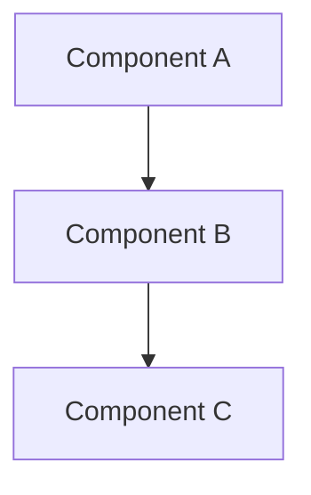

# CLAUDE.design.md

Phase-specific instructions for the **Design** phase. Extends [../CLAUDE.md](../CLAUDE.md).

## Purpose

This phase defines **how** we're building the system. Focus on architecture, data models, APIs, and key technical decisions.

## Files in This Phase

| File | Purpose |
|------|---------|
| [`architecture.md`](architecture.md) | System architecture overview and diagrams |
| [`data-model.md`](data-model.md) | Data structures, schemas, and relationships |
| [`api-design.md`](api-design.md) | API specifications and contracts |
| [`decisions/`](decisions/) | Decision Records (DEC-NNN) |

---

## Decisions Relevant to This Phase

<!-- Add rows as decisions are recorded. -->

| ID | Title | Trigger |
|----|-------|---------|
| [DEC-001](decisions/DEC-001-error-format.md) | Error Response Format | When specifying error responses for any API or interface |

---

## AI Guidelines

### Architecture
- Default to the simplest design that satisfies all requirements; add complexity only when justified
- Document component responsibilities and interactions
- Use Mermaid diagrams where helpful
- Reference requirements from `1-objectives/`

### Data Modeling
- Define clear schemas with types and constraints
- Document relationships between entities
- Consider data lifecycle (creation, updates, deletion)

### API Design
- Follow REST conventions or document deviations
- Define request/response formats clearly
- Document error handling and status codes
- Consider versioning strategy

### Diagrams

Use Mermaid syntax:

### Recording Decisions
When a significant decision is made during this phase, follow the procedure in [CLAUDE.md — Decisions](../CLAUDE.md#when-recording-decisions).

---

## Linking to Other Phases

- Reference requirements from `1-objectives/` to justify design choices
- Design documents guide implementation in `3-code/`
- Infrastructure design informs deployment in `4-deploy/`
