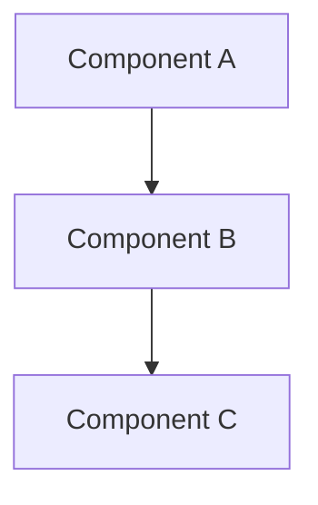

# CLAUDE.design.md

Phase-specific instructions for the **Design** phase. Extends [../CLAUDE.md](../CLAUDE.md).

## Purpose

This phase defines **how** we're building the system. Focus on architecture, data models, APIs, and key technical decisions.

## Files in This Phase

| File | Purpose |
|------|---------|
| `architecture.md` | System architecture overview and diagrams |
| `data-model.md` | Data structures, schemas, and relationships |
| `api-design.md` | API specifications and contracts |
| `decisions/` | Decision Records (DEC-NNN) |

---

## Decisions

All project decisions live in `decisions/`. Each decision has two files linked by a shared name stem:

- **`DEC-NNN-short-name.md`** — active record: current state of the decision and enforcement rules. Read during normal task execution when trigger conditions are met.
- **`DEC-NNN-short-name.history.md`** — decision trail: alternatives considered, reasoning, human involvement, and changelog. Read only when evaluating whether a decision is still valid or when proposing a change.

**Naming convention**: `NNN` is a three-digit sequential number (`001`, `002`, ...); `short-name` is a kebab-case summary (`api-contract`, `error-format`).

**Templates**: use `decisions/_template.md` and `decisions/_template.history.md` as starting points for new decisions.

### Agent navigation rules

- **During normal task execution**: consult the phase-specific decisions index below → read only the `DEC-NNN.md` files for relevant decisions → apply enforcement.
- **When evaluating or changing a decision**: read `DEC-NNN.md` first, then `DEC-NNN.history.md` → propose changes → update both files → append to the changelog with involvement type.
- **Never modify** `*.history.md` files except to append to the changelog or to add alternatives when proposing a supersession.

### Human involvement vocabulary

| Value | Meaning |
|-------|---------|
| `human-decided` | Human made the decision; AI had no significant role |
| `human-argued` | Human proposed and argued the rationale explicitly |
| `collaborative` | Human and AI jointly reasoned through options |
| `ai-proposed/human-approved` | AI proposed; human explicitly approved |
| `ai-proposed/auto-accepted` | AI proposed and recorded without explicit human approval |

### Decisions relevant to the design phase

| ID | Title | Trigger |
|----|-------|---------|
| [DEC-001](decisions/DEC-001-api-contract.md) | API Contract Design | When specifying or changing an API endpoint, request/response type, or response envelope |

---

## AI Guidelines for This Phase

### When Designing Architecture
- Default to the simplest design that satisfies all requirements; add complexity only when justified by a specific constraint or non-functional requirement
- Document component responsibilities and interactions
- Use diagrams where helpful (Mermaid syntax is preferred)
- Reference requirements from `1-objectives/`
- Apply any decisions from the index above whose trigger conditions match

### When Modeling Data
- Define clear schemas with types and constraints
- Document relationships between entities
- Consider data lifecycle (creation, updates, deletion)
- Plan for data validation and integrity
- Apply any decisions from the index above whose trigger conditions match

### When Designing APIs
- Follow REST conventions or document deviations
- Define request/response formats clearly
- Document error handling and status codes
- Consider versioning strategy
- Apply any decisions from the index above whose trigger conditions match

### When Recording Decisions
When a significant decision is made during the design phase:

1. Copy [`decisions/_template.md`](decisions/_template.md) → `decisions/DEC-NNN-short-name.md` and fill in all fields.
2. Copy [`decisions/_template.history.md`](decisions/_template.history.md) → `decisions/DEC-NNN-short-name.history.md` and fill in all fields.
3. If the decision has enforcement implications for the **design phase**, add it to the index above.
4. If the decision has enforcement implications for the **code phase**, also add it to the index in `3-code/CLAUDE.code.md`.

---

## Diagram Guidelines

Use Mermaid for diagrams:

## Linking to Other Phases

- Reference requirements from `1-objectives/` to justify design choices
- Design documents guide implementation in `3-code/`
- Infrastructure design informs deployment in `4-deploy/`
