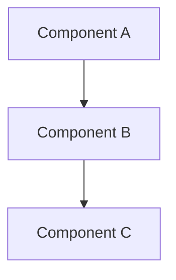

# CLAUDE.design.md

Phase-specific instructions for the **Design** phase. Extends [../CLAUDE.md](../CLAUDE.md).

## Purpose

This phase defines **how** we're building the system. Focus on architecture, data models, APIs, and key technical decisions.

## Files in This Phase

| File | Purpose |
|------|---------|
| `architecture.md` | System architecture overview and diagrams |
| `data-model.md` | Data structures, schemas, and relationships |
| `api-design.md` | API specifications and contracts |
| `decisions/` | Decision Records (DEC-NNN) |

---

## Decisions

All project decisions live in `decisions/`. Each decision has two files: `DEC-NNN-name.md` (active record, read during task execution) and `DEC-NNN-name.history.md` (trail, read only when evaluating or changing a decision). See [`decisions/README.md`](decisions/README.md) for the full format specification.

### Decisions relevant to the design phase

| ID | Title | Trigger |
|----|-------|---------|
| [DEC-001](decisions/DEC-001-api-contract.md) | API Contract Design | When specifying or changing an API endpoint, request/response type, or response envelope |

---

## AI Guidelines for This Phase

### When Designing Architecture
- Consider scalability, maintainability, and simplicity
- Document component responsibilities and interactions
- Use diagrams where helpful (Mermaid syntax is preferred)
- Reference requirements from `1-objectives/`

### When Modeling Data
- Define clear schemas with types and constraints
- Document relationships between entities
- Consider data lifecycle (creation, updates, deletion)
- Plan for data validation and integrity

### When Designing APIs
- Follow REST conventions or document deviations
- Define request/response formats clearly
- Document error handling and status codes
- Consider versioning strategy
- Apply DEC-001 for all API contract rules (named response types, response envelope, list field naming)

### When Recording Decisions

When a significant decision is made during the design phase:

1. Create `decisions/DEC-NNN-short-name.md` using the active record template in [`decisions/README.md`](decisions/README.md).
2. Create `decisions/DEC-NNN-short-name.history.md` using the trail template.
3. If the decision has enforcement implications for the **design phase**, add it to the index above.
4. If the decision has enforcement implications for the **code phase**, also add it to the index in `3-code/CLAUDE.code.md`.

---

## Diagram Guidelines

Use Mermaid for diagrams:

## Linking to Other Phases

- Reference requirements from `1-objectives/` to justify design choices
- Design documents guide implementation in `3-code/`
- Infrastructure design informs deployment in `4-deploy/`
