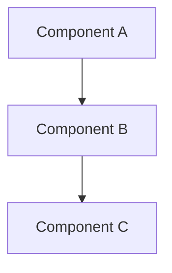

# CLAUDE.design.md

Phase-specific instructions for the **Design** phase. Extends [../CLAUDE.md](../CLAUDE.md).

## Purpose

This phase defines **how** we're building the system. Focus on architecture, data models, APIs, and key technical decisions.

## Files in This Phase

| File | Purpose |
|------|---------|
| `architecture.md` | System architecture overview and diagrams |
| `data-model.md` | Data structures, schemas, and relationships |
| `api-design.md` | API specifications and contracts |
| `decisions/` | Decision Records (DEC-NNN) |

---

## Decisions relevant to This Phase

| ID | Title | Trigger |
|----|-------|---------|
| [DEC-001](decisions/DEC-001-api-contract.md) | API Contract Design | When specifying or changing an API endpoint, request/response type, or response envelope |

---

## AI Guidelines for This Phase

### When Designing Architecture
- Default to the simplest design that satisfies all requirements; add complexity only when justified by a specific constraint or non-functional requirement
- Document component responsibilities and interactions
- Use diagrams where helpful (Mermaid syntax is preferred)
- Reference requirements from `1-objectives/`
- Apply any decisions from the index above whose trigger conditions match

### When Modeling Data
- Define clear schemas with types and constraints
- Document relationships between entities
- Consider data lifecycle (creation, updates, deletion)
- Plan for data validation and integrity
- Apply any decisions from the index above whose trigger conditions match

### When Designing APIs
- Follow REST conventions or document deviations
- Define request/response formats clearly
- Document error handling and status codes
- Consider versioning strategy
- Apply any decisions from the index above whose trigger conditions match

### When Recording Decisions
When a significant decision is made during this phase, record it as explained in [CLAUDE.md — Decisions](../CLAUDE.md#decisions).

---

## Diagram Guidelines

Use Mermaid for diagrams:

## Linking to Other Phases

- Reference requirements from `1-objectives/` to justify design choices
- Design documents guide implementation in `3-code/`
- Infrastructure design informs deployment in `4-deploy/`
